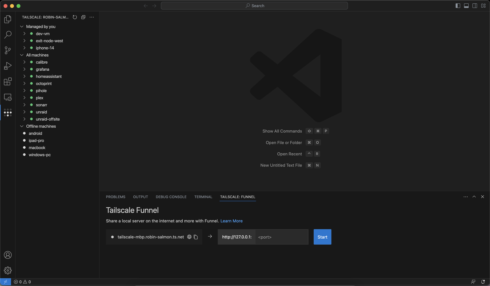

   
  

> Tailscale is a free and open source service, based on WireGuard®, that helps users build no-hassle virtual private networks. With a Tailscale network (tailnet), you can securely access services and devices on that tailnet from anywhere in the world. Tailnets can include anything from a Digital Ocean droplet to a Raspberry Pi, home security camera, or even a Steam Deck. You can share nodes with friends or co-workers, or even expose ports to the public internet with Tailscale Funnel.

# Tailscale for Visual Studio Code

The Tailscale extension for VS Code brings no-hassle, secure networking alongside your code. With Tailscale Funnel you can share anything from a device or node in your Tailscale network (tailnet) with anyone on the Internet.

## Features

### Explore remote machines

View and interact with machines on your tailnet within VS Code. Powered by [Tailscale SSH](https://tailscale.com/tailscale-ssh/), you can remotely manage files, open terminal sessions, or attach remote VS Code sessions.

#### Connect to a machine in your tailnet

You can start a new terminal session or attach VS Code to a machine for remote development in one click. Hover over the machine you'd like to connect to, and click the  icon to start a terminal session, or the  icon to attach the VS Code window to the machine.

#### Edit files on a machine in your tailnet

To view and edit files on a machine in your tailnet, expand the machine and click the **File explorer** item. You must have [enabled Tailscale SSH](https://tailscale.com/kb/1193/tailscale-ssh/#configure-tailscale-ssh) on the machine in order to use the file explorer.

### Expose a port over the internet

Route traffic from the internet to a node in your tailnet to publicly share it with anyone, even if they aren’t using Taiscale.

> _When you want something local to be available everywhere_

For example, you might want to receive a webhook from GitHub, share a local service with your coworker, or even host a personal blog or status page on your own computer.

#### Tailscale Funnel panel

1. Open the panel. You can use the keyboard shortcut `CMD` + `J`.
2. Enter the local port you want to expose over the internet in the **port** field.
3. Click **Start** to begin serving this port over the internet.

You can open the public URL in your default browser or copy it to your clipboard.

#### With the Command Palette

1. Open the command palette with the keyboard shortcut CMD + Shift + P.
2. Type **Tailscale** to view all of the extension’s commands.
3. Choose **Tailscale: Share port publicly using Funnel**.
4. Enter the local port number that you wish to share via Funnel.

#### Port discovery

When you start a local server from VS Code, Tailscale will ask if you'd like to share that port over the internet with Funnel.

This functionality can be disabled using the `tailscale.portDiscovery.enabled` option.

## How Funnel works

| Internet accessible                                                                                         | Secure tunnel                                                                                                        |
| ----------------------------------------------------------------------------------------------------------- | -------------------------------------------------------------------------------------------------------------------- |
| Stable and public DNS records point to Tailscale ingress servers, so your hostnames are always predictable. | Tailscale ingress servers forward TLS-encrypted traffic to your private nodes using our secure, lightweight tunnels. |

| End-to-end encrypted                                                                                         | Proxy or serve requests                                                                                     |
| ------------------------------------------------------------------------------------------------------------ | ----------------------------------------------------------------------------------------------------------- |
| Auto-provisioned TLS certificates terminate on your private nodes, so we never see your unencrypted traffic. | Serve local files, directories, or static content — or reverse proxy requests to a local web or TCP server. |

For more information, visit the full documentation on [Tailscale Funnel](https://tailscale.com/kb/1223/tailscale-funnel/) or the [CLI](https://tailscale.com/kb/1242/tailscale-serve/) reference.

## Setup

1. [Install Tailscale](https://tailscale.com/download) and login or create a new account.
2. [Install this extension](vscode:extension/Tailscale.vscode-tailscale) in VS Code.

> ⚠️ Important: You'll need to make sure that HTTPS certificates and Funnel are enabled in the Tailscale admin console. Refer to our [documentation](https://tailscale.com/kb/1223/tailscale-funnel/#setup) for more instructions.

## Commands

- _Tailscale: Share port publicly using Funnel_ - expose a single port publicly over Funnel.
- _Tailscale: Focus on Funnel View_ - open the Funnel panel view.

## Troubleshooting

If the extension isn't working, we recommend following these steps to troubleshoot.

1. Check to ensure that Tailscale is signed in and active. On macOS and Windows, you can do this by clicking the Tailscale icon in your OS status bar. On Linux, run `tailscale status` in your CLI.
   - If you have signed in to multiple Tailscale accounts on your device, ensure that the correct account is active.
2. Ensure that your Tailnet access controls (ACLs) are [configured to allow Tailscale Funnel](https://tailscale.com/kb/1223/tailscale-funnel/#setup) on your device.
3. Ensure that [magicDNS and HTTPS Certificates are enabled](https://tailscale.com/kb/1153/enabling-https/) on your tailnet.
4. If you are running `tailscaled` in a non-default path, you can set its path via the `tailscale.socketPath` setting in VS Code.

## Contribute

We appreciate your help! For information on contributing to this extension, refer to the [CONTRIBUTING](CONTRIBUTING.md) document.

## Legal

WireGuard is a registered trademark of Jason A. Donenfeld.
